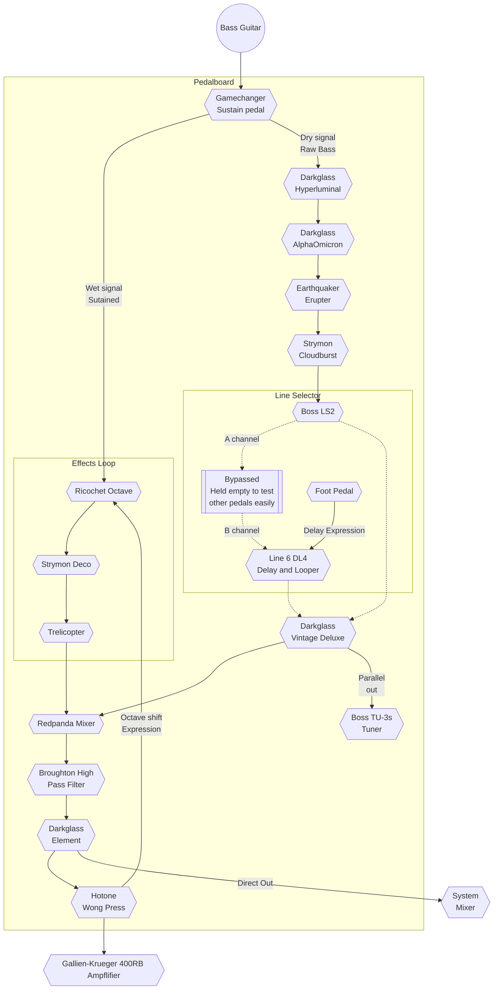

# Tardis Board

This is a description of my crazy bass rig, with a pedalboard that looks like the console of a TARDIS and really is bigger on the inside.

## Signal Chain

# My Bass: Kiesel 7-string Multifret

My bass is a custom 7-string multifret monstrosity from Kiesel guitars. With active pickups, the 7 strings and multifret design gives me a usable range approaching that of a standard piano.

It's a beast of an instrument, but the nature of a fretted instrument tuned in 4ths is octave changes require no fingering changes. This also means that having a low B string gives me a G in mid-fretboard position, and the entirety of my scale is available in a relatively small area both vertically and horizontally across my fretboard. I'm a bit of a lazy player, so like this versatility in a small area.

On a traditional bass, such as my Fender Geddy Lee 4-string, the tonal quality of notes varies widely in different positions. This is not the same on my multifret, and I find that the quality and tonal shift is great within the fretboard position I typically play in.

# Pedals

## GameChanger Plus Sustain

The very first pedal in my chain is the [Gamechanger Plus Sustain](https://gamechangeraudio.com/pluspedal/). This in an amazing pedal that acts like a piano sustain. You can think of it as a reverb for only the 1-3 notes that you want. It allows me to pick one note to wash in the background and then play over that note with whatever other notes I want. It also allows me to add a drone to the background to fill space in general.

### Wet/Dry Split

Immediately after getting this pedal, I noticed that I wanted to be able to have a clean, unsustained signal that is separate from the sustained signal. Thankfully, Gamechanger built the Plus with a clean/dry out and a wet out. That allows me to have a sustained raw bass note going straight to the mixer while my main signal is dry and goes through my pedals. It means I can have a distorted or reverbed bass without the sustain being distorted or reverbed.

### Wet signal/Effects Loop

Over a couple years of playing, I realized that the low frequency of the bass sustain muddies the overall sound, but I still wanted sustain. Gamechanger built the Plus with an effects loop that lets me modify the sustained signal.

#### DigiTech Ricochet Octave

The [Ricochet Octave](https://digitech.com/dp/whammy-ricochet/) from DigiTech gives a great pitchshifting character that allows me to brighten the tone of my bass into a higher register, allowing me to continue playing without muddying the sound.

#### Strymon Deco

The [Strymon Deco](https://www.strymon.net/product/deco/) is the first pedal I ever bought and one that has never left my board in some capacity. Originally I used it as a signal conditioner. Since moving more toward Darkglass products for that, it his found a place conditioning my sustained tone. The tape saturation side "thickens" my tone, making it richer, then the doubletracker is set at about 2 o'clock to give a slight chorusing effect, making the sustain less of a piercing sound. I can also add wobble in the doubletracker to give the sustain a bit of movement.

#### Mooer Trelicopter

Finally, I have a [Trelicopter](https://www.mooeraudio.com/products/79.html) for a classic tremolo. This provides the majority of the movement in the sustain and allows the sustain to be less a single note playing infinitely and sound a bit more like a Hammond backing the sound.

## Darkglass Hyperluminal Compressor

The dry signal coming out of the Gamechanger is my *main bass tone*, and that signal first goes through a [Darkglass Hyperluminal Compressor](https://www.darkglass.com/creation/hyper-luminal/). Ever since learning about Darkglass, I have bought their pedals at an embarrassing rate. My pedalboard never has less than 4 Darkglass pedals, and it often has more. The Hyperluminal is a great "invisible" compressor that has the best sound I've heard and adds no character of its own to my signal unless I want it to. It's magic. This provides a nice, clean, even amplitude across my range.

## Darkglass AlphaOmicron

The [AlphaOmicron](https://www.darkglass.com/creation/alpha-omicron/) is my main distortion pedal. I don't use distortion a ton–mostly I thicken with it as a touch of overdrive more than distortion–but when I do, I want it to be really good. This hits that mark. Like everything Darkglass makes, it's incredible. I opted for this over the [Omega](https://www.darkglass.com/creation/alpha-omega/) because I'm a *huge* fan of the Microtubes series, and have that as my preamp instead.

## Earthquaker Erupter Fuzz

Periodically, I want full on Fuzz and for that, I opt for the [Earthquaker Erupter](https://www.earthquakerdevices.com/erupter), like distortion, this is rare, and more an accent for me than an effect I use for an entire song. For instance, I use this during the chorus-only when my partner sings Elle King's Exes and Ohs.

## Strymon Cloudburst

I've had something like 17 different reverb pedals and they always end up being disappointing, or so complicated that I never bother using them (I'm looking at you, [NightSky](https://www.strymon.net/product/nightsky/)). One day, a friend handed me a [Strymon Cloudburst](https://www.strymon.net/product/cloudburst/) and my search was over. Super clean and gorgeous reverb without any noise and it's so super simple. I found that there's a particular setting that adds just enough richness to my tone that now the only thing I ever touch is the bypass pedal.

## Boss LS2 Line Selector

I have a bit of a pedal problem. Over the years, I've bought and sold probably 100 pedals. I love trying new ones to assess different effects and think about how I can use them. The [Boss LS-2 Line Selector](https://www.boss.info/global/products/ls-2/) has never stayed off my board for long. I've had dozens of different pedalboard configurations as I try to hone in on different sound combinations. I've done simple things like stacking gain stages and crazy things like running overdrive and reverb in parallel (I've even commissioned custom pedals to do these things). In the end, I simplified my set-up and narrowed down the line selector to more mundane usage.

### Line A

I have the line A empty at the moment, but it's ready for me to use whenever I have a new pedal I want to try out. That allows me to sit the pedal right next to the LS-2 on my board, plug it into line A, and use it without any reconfiguring of my board.

### Line B/

Line B goes into my Delay/Looper. It allows me to quickly pull this out of the chain, since it's a more rarely used pedal.

## Line 6 DL4

The newest pedal on my board is the [Line 6 DL-4 Mark II](https://shop-us.line6.com/dl4-mkii/dl4-mkii-delay-stompbox-modeler/). I mostly use this as a simple one-stomp looper pedal, but it also has an insane number of delay configurations that allow me to add a lot of depth to my tone. I'm still familiarizing myself with this one, I only got it on board recently as a replacement for the [Pigtroxix Infinity looper](https://www.pigtronix.com/pedals/infinity-looper/), which is amazing but too complex for what I needed in a looper.

## Darkglass Vintage Deluxe

Last in my main signal chain is the [Darkglass Vintage Deluxe preamp](https://www.darkglass.com/creation/vintage-deluxe/). This is my main tone-shaper/conditioner and one of the most critical pedals on my board. I'll never be without some Darkglass Preamp unless something better comes along, which will have to be from another planet because Darkglass is *incredible.*

## Boss TU-3s

The Vintage Deluxe has a parallel out signal that I used to use for even crazier effects than I have now, but as I dial in the signal more I use that less and less and now it serves only as an out-of-chain tuner signal by sending that to the [Boss TU-3s always-on tuner](https://www.boss.info/us/products/tu-3s/). This just lives in the upper left portion of my board, providing an always-on signal and tuning reference for me.

## Red Panda Mixer

After my preamp conditions my signal, my wet (sustain) and dry (main) signals get mixed together in a [Red Panda 3-channel mixer](https://www.redpandalab.com/products/mixer.html). I might be the only bass player with a mixer on my pedalboard (Psst… not a real bass player).

## Broughton High Pass Filter

After my signals are mixed, I send them through a [Broughton Always-on High Pass Filter (HPF)](https://www.broughtonaudio.com/product-page/always-on-high-pass-filter). This helps me clean up the muddiness of the low end and acts as a bit of a "boom noise gate." It only cuts the lowest of the low end so I still have my full, rich bass tone, just without the mud of the low-frequency noise floor. If I used more fuzz/distortion than overdrive, I would probably get something like the [Darkglass NSG](https://www.darkglass.com/creation/nsg-noise-gate/), but with the way that I play currently, the Broughton HPF is enough of a noise gate.

## Darkglass Element

I know… another Darkglass pedal. What is the deal?! The Element allows me to plug in headphones and have an aux-in signal (via Bluetooth) in order to practice, but it also acts as a cab simulator with a Direct Output. This allows me to feed my full signal straight out to the sound system's mixer with a simulated amplifier cabinet sound. It serves as my main signal to the sound system while letting me have a separate signal to my amplifier/monitor. Most of the time when I play bass, I send my signal through the direct output and use my amp to fill or act as a monitor.

## Hotone Wong Press

This is another new pedal. I had a Mission Volume pedal as last in my chain, post direct output but pre-amplifier. This mostly allows me to easily correct room tone and monitor-style amp volume while playing. Unfortunately, right before my last gig, my Mission pedal broke and I decided to replace it with a [Hotone Wong Press](https://shop.hotoneaudio.com/products/wong-press). This is a combined Volume/Expression/Wah pedal designed in partnership with [Cory Wong](https://www.corywongmusic.com/). Honestly, I'm not a wah-style player, so I probably won't use that functionality, but I like the idea of having a pedal that can serve dual purpose as an expression and a volume pedal. I don't use expression pedals too terribly much, but when I want one, I *really* want one, and this lets me have one available in those rare occasions without taking up extra space.

# Pedalboard and Power

## Pedal Pad Custom Pedalboard

All of this sits on a [PedalPad Phat-III](https://pedalpad.com/product/phat-iii-pedal-board/) two-level custom pedalboard. On the right side, it has a power in, on/off switch and two TS/TRS inputs. I plug my bass into input one. On the left side, it has two TS/TRS outputs and an XLR Output that serves my Direct Out.

The two layer design allows me to have my power supplies, HPF, and sometimes I put my compressor down there as well, since I don't normally turn that off.

## Strymon Clean Power

All these pedals are powered by a [Strymon Zuma](https://www.strymon.net/product/zuma/) 9-outlet power supply with two [Strymon Ojai](https://www.strymon.net/product/ojai-expansion-kits/) expanders adding 5-outlets each. I love Strymon supplies because they are all isolated power and completely clean. The Zuma gives me two 12v and 18v power supplies if I need them.

# Amplifiers

My main amp is an old [Gallien-Krueger 400RB](https://www.gallien-krueger.com/rb-heads) head that's been discontinued for a number of years, that feeds 2 custom made 14 inch speaker cabinets. This sits in a rack case with a big power conditioner and some other stuff. Both the head and the cabinets I got for free from a coworker years ago who was not playing anymore and just wanted them to be used. This is a mammoth rig that can fill a small stadium with sound, it's a bit over-powered to be what is effectively my practice rig. In fact, I only have one cabinet in my house, the other cabinet is out in the garage taking up space there.

Traveling around, I often use an [Ampeg Micro-CL 2x10](https://ampeg.com/products/classic/micro/). 

## Darkglass Amp desires
Both of these amps are are workable, but the Gallien-Krueger is just too big to take anywhere, so sits in my house taking up an *entire* corner of a room, with my Micro-CL travel amp taking up another corner. It's a lot of gear for not alot of use. My current plan is to sell my mammoth Gallien-Krueger system *and* my Ampeg Micro-CL and buy one [Darkglass Microtubes 500 Combo 210](https://www.darkglass.com/creation/microtubes-500-combo-210/) to use both as my home/practice amp AND my travel/gig amp. 