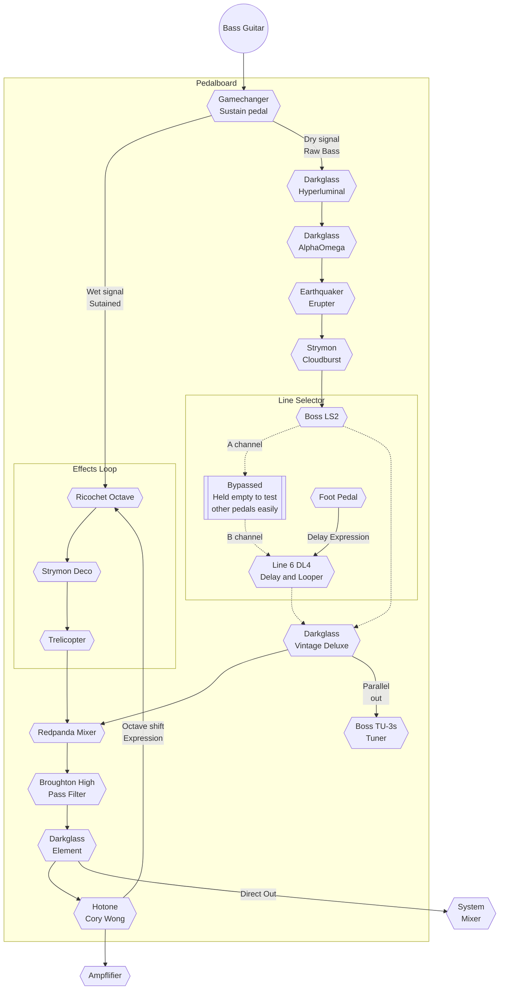

# pedalboard
Description of my crazy bass pedalboard

```mermaid
flowchart  

    bass((Bass Guitar)) --> gc{{Gamechanger<br/>Sustain pedal}}

    subgraph Pedalboard

            gc --> | Wet signal <br/> Sutained | octave{{Ricochet Octave}}
            gc --> | Dry signal <br/> Raw Bass | hyper{{Darkglass <br/> Hyperluminal}}

        subgraph Effects Loop   
            octave --> deco{{Strymon Deco}}
            deco --> trem{{Trelicopter}}
        end
        trem --> mixer{{Redpanda Mixer}}

        hyper -->alpha{{Darkglass <br/> AlphaOmega}}
        alpha -->fuzz{{Earthquaker <br/> Erupter}}
        fuzz --> cloud{{Strymon <br/> Cloudburst}}

        cloud --> ls2{{Boss LS2}}

        subgraph Line Selector
            ls2 -.-> | A channel | na[[Bypassed <br/> Held empty to test<br/>other pedals easily]]
            na -.-> | B channel | dl4{{Line 6 DL4 <br/> Delay and Looper}}
            exp{{Foot Pedal}} --> |Delay Expression| dl4
        end

        dl4 -.-> vintage{{Darkglass <br/> Vintage Deluxe}}
        ls2 -.-> vintage
        vintage --> mixer

        vintage --> |Parallel <br/> out| tu3{{Boss TU-3s <br/> Tuner}}

        mixer --> hpf{{Broughton High <br/> Pass Filter}}
        hpf --> element{{Darkglass <br/> Element}}

        element --> volume{{Hotone <br/> Cory Wong}}
        volume --> | Octave shift <br/> Expression | octave
    end

    element --> | Direct Out | sys{{System <br/> Mixer}}

    volume --> amp{{Ampflifier}}
```

